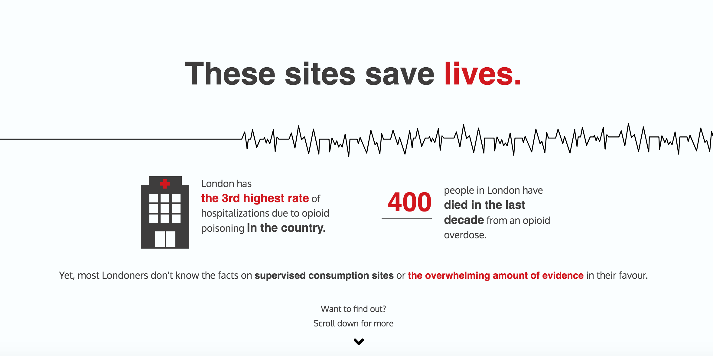

# Supervised Consumption Sites Infographic 

My one page infographic website on London, Ontario's opioid crisis and supervised consumption sites.

## Features

* Responsive Greensock Animations 
* Interactive "Supervised consumption sites are a place to" section

## Getting Started

### Prerequisites

To locally host this website, you’ll need Git installed on your computer.
[See detailed install instructions here.](https://gist.github.com/derhuerst/1b15ff4652a867391f03)

You'll also need to access PHPMyAdmin to import the scs database and view the second section of the site.

### Installing

After cloning this repository 

#### 1. Navigate to db and download db_scs.sql 

#### 2. Go to your PHPMyAdmin and create a shell database

#### 3. Import db_scs.sql 

And you’re done and ready to view!

## Built With

* [Greensock](https://greensock.com/) - Used for animations
* [Fetch API](https://developer.mozilla.org/en-US/docs/Web/API/Fetch_API) - Used for "Supervised        consumption sites are a place to" section
* [Waypoints](http://imakewebthings.com/waypoints/) - Used for animations that initialize on scroll
* [CSS Grid](https://cssreference.io/css-grid/)
* [CSS Flexbox](https://cssreference.io/flexbox/)  

## Authors

* [**Emma Blue**](https://github.com/EmmaBlue) - *Developer, Writer and Designer*
* [**Marie Fiedler**](https://www.facebook.com/marie.fiedler.5) - *Researcher*

## License

This project is licensed under the [MIT License](https://opensource.org/licenses/MIT/).

